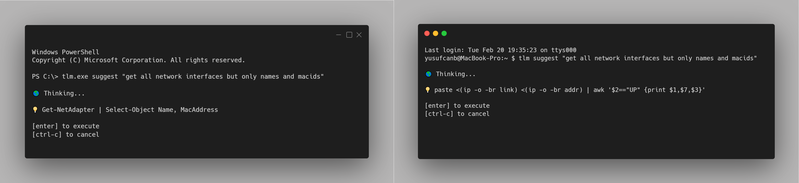

# tlm - Your Terminal Intelligence with Local LLM

tlm is your CLI companion which requires nothing then your workstation. It uses most efficient and powerful [CodeLLaMa](https://ai.meta.com/blog/code-llama-large-language-model-coding/) in your local environment to provide you the best possible command line suggestions.

## Features

- 💸 No API Key (Subscription) is required. (ChatGPT, Github Copilot, Azure OpenAI, etc.) 

- 📡 No internet connection is required.

- 💻 Works on MacOS, Linux and Windows.

- 👩🏻‍💻 Automatic shell detection.
 
- 🚀 One liner generation and command explanation.


## Usage

```
$ tlm help

NAME:
   tlm - local terminal companion powered by CodeLLaMa.
                                                       
USAGE:                                                 
   tlm [global options] command [command options]      
                                                       
VERSION:                                               
   1.0-rc1

COMMANDS:
   suggest, s  suggest a command.
   explain, e  explain a command.
   install, i  deploy CodeLLaMa to your system.
   config, c   configure preferences.
   version, v  print version.

GLOBAL OPTIONS:
   --help, -h     show help
   --version, -v  print the version

```




## Installation

### Linux & MacOS

Download latest release;

```bash
curl -fsSL -o tlm https://github.com/yusufcanb/tlm/releases/download/1.0-rc1/tlm_1.0-rc1_linux_amd64
```

Make it executable;

```powershell
chmod +x tlm
```

Move it to your `$PATH`;

```bash
sudo mv tlm /usr/local/bin
```

> [!TIP]
> If you already have CodeLLaMa on your system, you can just use the following command to configure it;

```
tlm config set llm.host <codellama_host>
```

Otherwise, you can use the following command to install CodeLLaMa;

```bash
tlm install
```
Finally, follow the instructions to install CodeLLaMa. This will install CodeLLaMa on your system and configure tlm to use it.

### Windows

Download latest release;

```powershell
Invoke-WebRequest -Uri "https://github.com/yusufcanb/tlm/releases/download/1.0-rc1/tlama_1.0-rc1_windows_amd64.exe" -OutFile "tlm.exe"
```

> [!TIP]
> If you already have CodeLLaMa on your system, you can just use the following command to configure it;

```
.\tlm.exe config set llm.host <codellama_host>
```

Otherwise, you can use the following command to install CodeLLaMa;

```powershell
.\tlm.exe install
```

And follow the instructions to install CodeLLaMa. This will install CodeLLaMa on your system and configure tlm to use it.


## Uninstall

On Linux and MacOS;

```bash
rm /usr/local/bin/tlm
```
