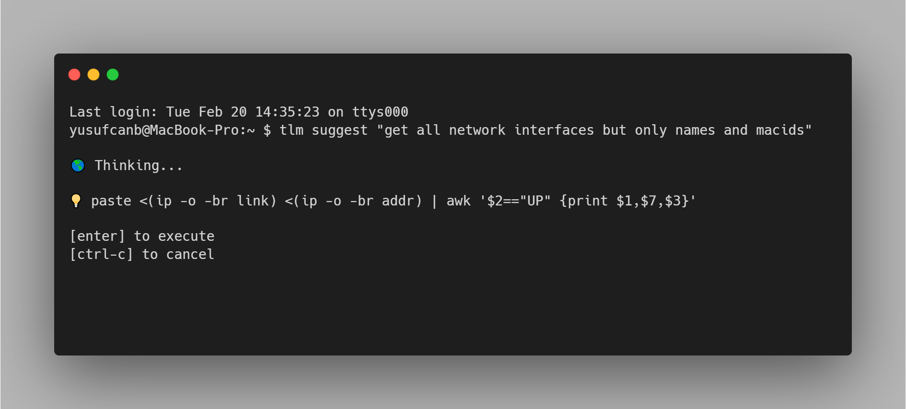
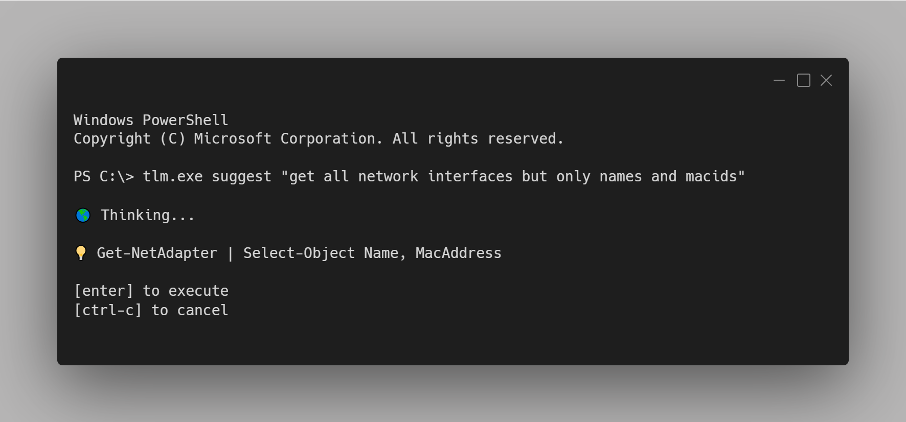

# tlm - Your Terminal Intelligence with Local LLM

tlm is your CLI companion which requires nothing then your workstation. It uses most efficient and powerful [CodeLLaMa](https://ai.meta.com/blog/code-llama-large-language-model-coding/) in your local environment to provide you the best possible command line suggestions.

## Features

- 💸 No API Key (Subscription) is required. (ChatGPT, Github Copilot, Azure OpenAI, etc.) 

- 📡 No internet connection is required.

- 💻 Works on MacOS, Linux and Windows.

- 👩🏻‍💻 Automatic shell detection.


MacOS             |  Windows |
:-------------------------:|:-------------------------:
  |  


## Installation

### Linux & MacOS

Download latest release;

```bash
curl -fsSL -o tlm https://raw.githubusercontent.com/yusufcanb/tlama/master/get-tlama.sh
```

### Windows

Download latest release;

```powershell
Invoke-WebRequest -Uri "https://raw.githubusercontent.com/yusufcanb/tlama/master/" -OutFile "tlm.exe"
```

> If you already have CodeLLaMa on your system, you can just use the following command to configure it;
> 
> `.\tlm.exe config set llm.host <codellama_host>`


Then, you can use the following command to install CodeLLaMa;

```powershell
Exec .\tlm install
```

And follow the instructions to install CodeLLaMa. This will install CodeLLaMa on your system and configure tlm to use it.

## Usage


## Uninstall

On Linux;

```bash
rm /usr/local/bin/tlama
```
